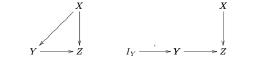
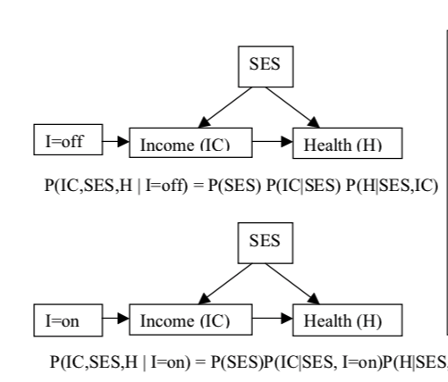
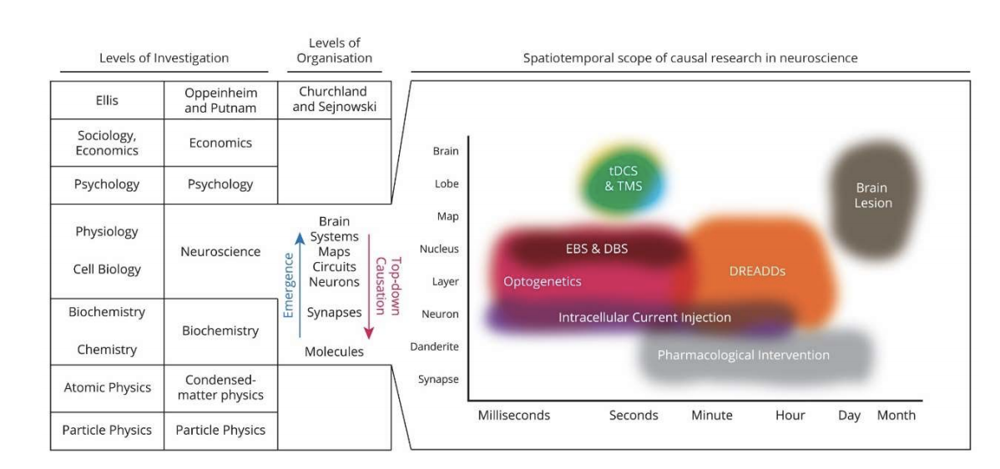

# Interventions for Causal Discovery

The essence of science is finding answers to questions such as what, how and why a phenomenon is, if at all, happening. For a neuroscientist like myself, it would be answering questions what neural firing patterns does a given image produce, how this pattern of firing lead to perception  and why a certain response or reaction is happening. But unlike mathematics where hypotheses/conjectures are provable through axioms and theorems, science has a handicap that we cannot prove a phenomenon but only gather evidence, more and more of them. What better evidence can one gather for a phenomena than identifying the variables that cause it, discover the underlying causal structure the links them, and observe or, even better, predict outcomes — ideally, those that aren’t not seen before — as we manipulate the causes. Some of the greatest discoveries, like Galileo’s inclined plane experiments to understand  acceleration due to gravity, involved doing causal manipulations to isolate and understand a phenomenon even before the field of Causality even became formalised.  So, one could say that understanding causal structure of a phenomenon and using that to predict and manipulates outcomes is strongly rooted in science. I would even go as far to say that if one is really honest, most scientists — forgetting the practicalities for the moment — want their discoveries to be causal. 

But when and how can we discover the causal structure? Are purely observational data, available in abundance, enough to learn the structure and what are some assumptions that need to be satisfied ? Or are perturbations a must? What is the current SOTA (State-of-the-art)? The answer to the first question, formally called identifiability, has been reviewed by my colleague in her post here. In this post, we try to answer the second questions onwards and we specially focus on when are interventions needed and how it can be used to learn the causal structure.  Before that, why are we even interested in causality? As neuroscientists, we wish to understand the causal framework under which different entities in the brain starting with neurotransmitters to neural network level and finally, systems level interact with one another.  In addition, causal research helps us to build on top of each others research. 

In this post, we focus mainly on the causal bayes net framework worked on extensively by Pearl [2], Spirites [3], Claymour [3], and Scheines [3]. This framework connects a causal structure, specified as a directed acyclic (DAG) graph, over a set of variables with a probability distribution over those variables. 

## The Identifiability problem 

In the framework of causal bayes net, causal discovery can be characterised as the problem of identifying as many causal relations between observed set of variable as possible. This turns out to be a hard problem and one needs to make some assumptions to identify the structure. The four principle assumptions [1] made whilst causal discovery — the first two being the strongly enforced ones — are: 

1. **Causal Markov:**	

   - The causal Markov condition states that every vertex X in the graph G is probabilistically independent of its non-descendents given its parents.

2. **Causal Faithfulness:**

   - If a variable X is independent of Y given a conditioning set C in the probability distribution P (V),
     Where V is set of vertices then X is d-separated from Y given C in the graph G.

3. **Acyclicity:**

   -  There is no directed path from a vertex back to itself in G

4. **Causal Sufficiency:**

   - There are no unmeasured common causes of any pair of variables in V

   

## What can we learn just from passive observations? 

*Summarise some approaches and indicate their failures*. *I was considering of writing another post where I concentrate the algorithms I have cited here. Pythonize them if possible.*

Note: There are several causal discovery techniques whose history has been beautifully summarised by Eberhardt [1].  His work on causal discovery strongly serves as the base for this post. You can check out his recent publications here.

Given that the four aforementioned assumptions are satisfied, for linear Gaussians and multinomial causal relations, we can learn the underlying causal structure up to DAGs that form a Markov equivalence class from just the observational distribution. More details about this can be found in our other post.  There are algorithms, like PC [4] and GES [5], constrained by the aforementioned conditions that can find most, if not all, Markov equivalent classes given an observational dataset. But some of assumptions don’t hold in practice, for instance, causal sufficiency is hard to satisfy as there might be common causes that we have not measured and, luckily for us, there are approaches that find causal structure even upon relaxing some constraints. For example, the FCI algorithm [3] relaxes the causal sufficiency constraint while searching for the causal structure; the CCD-algorithm [3,7] drops the acyclicity assumption; Zhang et al [8] came up with an approach that weakens the faithfulness assumption. But relaxing the constraints comes at a cost, it increases the underdetermination of underlying causal structure. It is important to note that the best we can do with  these algorithms that assume linear Gaussians and multinomial causal relations is to find the set of  Markov equivalent graphs. 

However, something interesting happens when we consider non-gaussian distributions or non-linear function mappings. We can actually get over the Markov equivalence limitation that we faced earlier and uniquely identify causal structure. LiNGAMS (Linear Non-Gaussian Additive Models), developed by Schimizu [9], is an approach that uses ICA to identify the causal structure for linear non-Gaussian noise distributions under addition and Peters et al [10] use  functional model to uniquely identify underlying causal structure for non-linear function mappings. 

Having considered the challenge of causal discovery in terms of finding weak generic assumptions, a completely different —but probably the most used — way to narrow down our search space and uniquely identify causal structure is incorporating background knowledge. We usually have some idea of how the causal structure could look like and a class of solvers called general constraint satisfaction solvers have enabled the integration of background information into the causal discovery procedure. The high-level idea of these approaches is to encode (to the extent possible) all the available information as constraints in propositional logic on the underlying causal graph structure. The nice feature of using these solvers is that they are incredibly versatile in terms of the information they can integrate into the search procedure, and while they can achieve remarkably accurate results, they do not yet scale as well as other causal discovery algorithms.  

## Limitations of learning from just passive observations motivate the need for interventions

The approaches like PC, GES mentioned earlier work under our four principle constraints for linear Gaussian distributions and, even in the large sample limit, can best identify the markov equivalence class containing the true graph. If the search method is limited to independence constraints, then in general, interventions are a must to uniquely identify the true graph in a Markov equivalence class. 

The LiNGAM-algorithm suggests that there are no limitations to structure search in passive observational data – at least not in principle, Furthermore, for non-normally distributed data any structure among the observed variables can be discovered.  The limitation that the results do not hold for normally distributed data is a rather minor weakness. However, the results do not extend to discrete variables. Much of the methods we will discover henceforth, but not all, will provide methods and results that apply to structure search for discrete models as well.

## What are interventions and can they help?

Before we go any further, lets formally define interventions. In a causal Bayes net $G=(V,E)$, Pearl [2] represents
an intervention on a variable $X ∈ V $ by an intervention variable I that is added to the causal structure $G$ with a direct link $I → X$ into the intervened variable. For Pearl, the intervention variable can take values in  {$$idle,do(x_i)$$}​
where $ x_i$ ranges over the values of $X_i$. 

$ P\left(X_{i}=x_{i} | p a_{i}, I_{i}\right)=\left\{\begin{array}{ll}{P\left(X_{i}=x_{i} | p a_{i}\right)} & {\text { if } I_{i}=i d l e} \\ {0} & {\text { if } I_{i}=d o\left(x_{i}^{\prime}\right) \text { and } x_{i} \neq x_{i}^{\prime}} \\ {1} & {\text { if } I_{i}=d o\left(x_{i}^{\prime}\right) \text { and } x_{i}=x_{i}^{\prime}}\end{array}\right. $

Note that in contrast to Fisher’s randomisations [11] that determine a distribution over the intervened variable, Pearl’s atomic intervention sets the intervened variable to one particular value. Let's quickly take a look at a simple toy example. In the causal bayes net shown below (Figure 1. left), we intervene  the random variable $Y$ and one can see how the causal structure has changes. The causal influence of $X$ on $Y$ — marked by the arrow in the graph— doesn’t have any impact any more and the arrow has been severed post intervention (Figure 1. right).

​		       **Figure 1:** Toy example demonstrating the effect of intervention on a random variable in a causal graph.

The advantage of interventions is that they expand the set of criteria that can be used for identification of causal structure. Interventions provide in addition to the passive obervational distribution over the variables, a manipulated distribution. Different graphs, that appear equivalent given passive observational data only, can be distinguished by their different manipulated distributions. Let’s try to understand this statement with help of a toy example where we try to distinguish a Markov equivalent class of graphs.

$\begin{array}{l}{\text { 1. } X \leftarrow Y \rightarrow Z} \\ {\text { 2. } X \rightarrow Y \rightarrow Z} \\ {\text { 3. } X\leftarrow  Y \leftarrow Z}\end{array}$

If we perform an intervention  on say the random variable $Y$ (either Pearl’s atomic discussed above or Fisher’s method of randomising the random variable  of interest such that it becomes independent of its causes), in the first case as Y is the common cause of $X$ and $Z$ without a parent, the graph remains the same and dependencies intact (Fig 3. . Whereas in the second case, $X$ and $Y$ become independent but not $Y$ and $Z$. Lastly, in the third case, $Z$ and $Y$ become independent due to severing of link between them and $Y$ and $X$ are dependent. Consequently, one can see that interventions are not only of interest to make discovery possible at all, but also to enable discovery with means that would not suffice if only passive observational data were available. Check our Ferenc Huszar’s cool blog plot where he illustrates (atomic) interventions through a simple toy example here: https://www.inference.vc/causal-inference-2-illustrating-interventions-in-a-toy-example/

$\begin{array}{l}{\text { 1. } X \leftarrow Y \rightarrow Z} \\ {\text { 2. } X \quad Y \rightarrow Z} \\ {\text { 3. } X\leftarrow  Y \quad Z}\end{array}$

NB:

-  It was on the basis of interventions on a single variable that Pearl developed do-calculus: a method, shown to be complete, for computing the effect of interventions on the probability distribution over the set of variables. 
- You can also check out Ferenc’s post on introduction to do-calculus here: https://www.inference.vc/untitled/

--------------

### Bonus Material (Unformatted)

“Let X,Y and Z be arbitrary disjoint sets of nodes in a causal DAG G. We denote by GX the graph obtained by deleting from G all arrows pointing to nodes in X. Likewise, we denote by GX the graph obtained by deleting
from G all arrows emerging from nodes in X. To represent the deletion of both incoming and outgoing arrows, we use the notation GXZ [...]. Finally, the expression P(y|xˆ,z) 􏰳 P(y,z|xˆ)/P(z|xˆ) stands for the probability of Y = y given that X is held constant at x and that (under this condition) Z = z is observed.

#### Pearl’s Rules of do-Calculus

 Let G be the directed acyclic graph associated with a causal model and let P(.) stand for the probability distribution induced by that model. For any disjoint subsets of variables X, Y, Z and W , we have the following rules. 

Rule 1: (insertion/deletion of observations)
 P (y|xˆ, z, w) = P (y|xˆ, w) if (Y⊥Z|X, W )GX 

Rule 2: (action/ observation exchange)
 P(y|xˆ,zˆ,w) = P(y|xˆ,z,w) if (Y⊥Z|X,W)GXZ 

Rule 3: (insertion/ deletion of actions)
 P(y|xˆ,zˆ,w) = P(y|xˆ,w) if (Y⊥Z|X,W)GXZ(W) 

where Z(W) is the set of Z-nodes that are not ancestors of any W-node in GX.” 

####  Pearl: Identifiability

“A causal effect q = P(y1,...,yk|xˆ1,...,xˆm) is identifiable in a model characterized by a graph G if there exists a finite sequence of transformations, each conforming to one of the inference rules in the theorem above, that reduces q into a standard (i.e. “hat”-free) probability expression involving observed quantities.” 

#### Pearl: Causal Effect

 “Given two disjoint sets of variables, X and Y, the causal effect of X on Y, denoted either as P(y|xˆ) or as P(y|do(x)), is a function from X to the space of probability distributions on Y. For each realization x of X, P(y|xˆ) gives the probability of Y = y induced by deleting from the model all equations corre- sponding to variables in X and substituting X = x in the remaining equations.” 

So, for Pearl, for two variables to stand in the relationship of cause and effect amounts to a functional relation between the manipulation of variables in set X and the probability distribution over a set of variables Y. However, this function is only defined in terms of a model and the appropriate changes of equations in a model. Pearl’s account of intervention does not tell us what constitutes an intervention until a model has been specified. 

--------

## Causal discovery using interventions

How interventions should be placed in order to distinguish different causal structures and under which circumstances different types of interventions distinguish different causal structures is the subject of this section. Causal discovery approaches not only depends on what kind of interventions one can use, but also on what kind of assumptions one can make about the models considered. Here on in, we assume that the causal Markov and faithfulness assumptions are satisfied and ignore the acyclicity and  causal sufficiency. We next describe two sorts of interventions called "structural” and “parametric” interventions [1] that seem crucial for causal discovery but before that let's try to formalise the notations. ). The causal Markov condition amounts to assuming that the probability distribution over the variables in a causal graph factors according to the graph as so:

$P(X)=\prod_{k \in t} P\left(X_{i} | \text { parents }\left(X_{i}\right)\right)$

where the parents of $X_i$ are the immediate causes of $X_i$ , and if there are no parents then the marginal distribution

 P($X_i$) is used.  An example DAG with its factored joint distribution is shown below. 

​			                       **Figure 2:** Example Graphical Model to show Factored Joint Distribution

### Stuctural Intervention

Lets define *structural* intervention on variable $T$ in the DAG shown below defined over set of vertices $V$. As per our definition of intervention, we introduce an instrumental variable $I$, which has two states (*on*/*off*). When $I$ is *off*, the passive observational distribution over $V$ is obtained.  Note that $I$ is a direct cause of $T$ and only $T$ and is exogenous, i.e. uncaused.  When $I$ is *on*, it makes $T$ independent of its causes in $V$ (breaks the edges that are incident on $T$) and *determines* the distribution of $T$; that is, in the factored joint distribution $P(V)$, the term $P(T | parents(T))$ is replaced with the term $P(T |I=on)$, all other terms in the factorized joint distribution are unchanged. 

​		                                     **Figure 3:** Example Graphical Model for Structural Intervention 

####Most common “structural” intervention method: Randomised control experiments, and its failures

In cases we considered until now, we mostly did atomic intervention i.e. Pearl’s type of intervention scheme but there is another type of intervention, developed by Fisher [11], based on randomisation. It basically involves randomising the random variable of interest such that it becomes independent of its cause. Thus, allowing us to estimate the true causal effect of that variable on the others. Let's consider a simple example where we want to estimate the causal effect of treatment on the recovery of the patient. As the first step in the estimation, one randomly assigns the treatment $T$ according to a noise distribution, $N_T$,  to a patient and, then, observes the (binary) recovery variable $R$. Assume that $T$ takes three possible values ($T$= 0: no medication, $T$ = 1: placebo, and $T$ = 2: drug of interest) and that $N_T$ randomly chooses one of these three possibilities: *P*($N_T$ = 0) = *P*($N_T$  = 1) = *P*($N_T$  = 2) = 1/3. If we use do-calculus notation to mathematically summarise the steps, such a randomisation is modelled with observing data from the distribution $P_{\mathbf{X}}^{\mathbf{C} ; d o\left(T :=\widehat{N}_{T}\right)}$ where $C$ denotes the original structural causal model without randomisation. This process can be graphically visualised as below: 

**Figure 4:** Simplified description of randomized studies. *T* denotes the treatment, *P* and *B* the patient’s psychology and some biochemical state, and *R* indicates whether the patient recovers. The randomization over *T* removes the influence of any other variable on *T*, and thus there cannot be any hidden common cause between *T* and *R*. We distinguish between two different effects: the placebo effect via *P* and the biochemical effect via *B*.

If we then still find a dependence between the treatment and recovery, we conclude that *T* has a total causal effect on the recovery. It may turn out, however, that there is a total causal effect independently of the type of drug. A simplified description can be found in Figure 4. A patient’s psychology (*P*) changes, when taking a pill independently of its content, which then affects the recovery. Let us assume that this placebo effect is the same for the placebo and the drug of interest. That is, the structural assignment for *P* satisfies 

​                                                  $f_{P}\left(T=0, N_{P}\right) \neq f_{P}\left(T=1, N_{P}\right)=f_{P}\left(T=2, N_{P}\right)$

In pharmaceutical studies, we are more interested in the biochemical effect than the placebo effect. We therefore restrict the randomization to be supported on placebo and drug of interest, that is, *P*($N_T$ = 0) = 0. If we then still see a dependence between treatment *T* and recovery *R*, this must be due to a biochemical effect.

#### Limitations of RCEs

Although randomized trials have become de facto the gold standard for causal discovery in the natural and behavioral sciences, without such an a priori designation of causes and effects Fisher’s theory is far from complete. 

- First, without knowing ahead of time which variables are potential causes and which effects, more than one experiment is required to identify the causal structure – but we have no account of an optimal sequence of experiments. 
- Second, we don’t know how to statistically combine the results of two experiments involving interventions on different sets of variables. Third, randomized assignments of treatment are but one kind of intervention.

### Parameteric Intervention

Lets now go on and define *parametric* intervention on variable $T$ in the DAG shown below defined over set of vertices $V$.  $I$ Is a variable which has two states (*on*/*off*). When $I$ is *off*, the passive observational distribution over $V$ is obtained.  As before $I$ is a direct cause of $X$ and only $X$ and is exogenous, i.e. uncaused.  When $I$ is *on*, it doesn’t make $IC$ independent of its causes in $V$ (does not break the edges that are incident on $IC$). In the factored joint distribution $P(V)$, the term $P(IC | parents(IC))$ is replaced with the term $P(IC |I=on)$ and otherwise, all other terms are unchanged. But how do you instantiate such a parametric intervention in practise, you may ask? If the intervened variable is a linear (or additive) function of its parents, then the intervention could be an additional linear factor. For example, if the target is *income*, the intervention could be to boost the subject’s existing income by $10,000/year.

1. 

​												**Figure 5:**  Example Graphical Model for Parametric Intervention 

In practice parametric interventions can arise for at least two reasons.

- When it might be impossible to perform a structural intervention. 
  - For example, Campbell [12] argues that one cannot perform a structural intervention on mental states, since it is impossible to  make a mental state independent of its other causes: One can make a subject believe something, but that belief will not be independent of, for example, prior beliefs and experiences. Or if it is, then it is questionable whether one can still speak of the *same* subject that has this belief.
- When the cost of a  structural intervention is too high or when a structural intervention of a particular variable would be unethical.
  - For example, it is in principle possible to randomly assign (structural intervention) income, but the cost would be enormous and it is unethical to assign someone an income that would be insufficient for survival, while denying the participants  their normal income. In such cases one might instead add a fixed amount to the income of the subjects (parametric intervention). Income would then remain a function of its prior causes (like education, parental income, socio economic status etc.), but would be modified by the parametric intervention. 

### Comparing structural and parametric interventions

- Structural intervention of the wrong variable might then not be informative about the true causal structure, since even the manipulated distribution could have been generated by several different causal structures.
  - For example, consider the below Figure 6. If you intervene on $C$ as seen in (2), it would make the pairs A-C and B-C independent, since the incoming arrows on $C$ are broken in the post-manipulation graph. Now, the only link remaining would be between $A$ and $B$ but their direction can only be determined with another intervention on either $A$ or $B$. Interestingly, the manipulated distribution we have now could as well have been generated by (3), here the true causal graph has no causal links between A and C or B and C. Hence, we can say that structural intervention also lead to Markov equivalence classes of graphs. Note that a further structural intervention on $A$ in a second experiment would distinguish (1) from (3), since $A$ and $C$ would be correlated in (1) while they would be independent in (3).

​											**Figure 6:** Example of failure case of Structural Intervention

- Learning the underlying causal structure using parametric intervention.
  - The following example, illustrated in the below figure, explains the result: The true unknown complete graph among the variables $A$, $B$ and $C$ is shown on the left. If we In an experiment  perform simultaneously and independently a parametric intervention on $A$ and $B$ ($I_A$ and $I_B$, respectively, shown on the right). Since the interventions do not break any edges, the graph on the right represents the post-manipulation graph. Note that $A$, $B$ and $I_{B}$ form an unshielded collider, so do $C$, $B$ and $I_{B}$ and thus can can be identified. The edge $A$ to $C$ can be determined since (i) $A$ and $C$ are dependent for all possible conditioning sets, but (ii) $I_{A}$, $A$ and $C$ do *not* form an unshielded collider. We have thereby managed to discover the true causal graph in one experiment. 

. 

​	 		**Figure 7:** Demonstrating the use of Parametric Intervention to discover underlying causal structure

- Eberhardt et al [13] showed that for N causally sufficient variables N-1 experiments are sufficient and in the worst case necessary to discover the causal structure among a causally sufficient set of N variables if at most one variable can be subjected to a structural intervention per experiment assuming faithfulness. If multiple variables can be randomized simultaneously and independently in one experiment, this bound can be reduced to log(N) + 1 experiments [14]. These bounds both assume that an experiment specifies a subset of the variables under consideration that are subject to an intervention and that each experiment returns the independence relations true in the manipulated population, i.e. issues of sample variability are not addressed.

  - Parametric interventions do not destroy any of the causal structure. However, if only a single parametric intervention is allowed, then there is no difference in the number of experiments between structural and parametric interventions.

  - For experiments that can include simultaneous interventions on several variables, however, we can decrease the number of experiments from log(N) + 1 to a *single* experiment when using parametric interventions.

  - The table below may tempt the conclusion that parametric interventions are always better than structural interventions. But this would be a mistake since it hide the cost of  this procedure. 

    - First, determining the causal structure from parametric interventions requires more conditional independence tests with larger conditioning sets. This implies  that more samples are needed to obtain a similar statistical power on the independence tests as in the structural intervention case. 
    - Second, the theorems [13, 14] only hold in  general for causally sufficient sets of variables

    

    ​               															  **Table 1**  

- Unlike randomised trials, parametric interventions are not robust against latent confounders, since they do not make the intervened variable independent of its other causes. This implies that there are cases for which the causal structure cannot be uniquely identified by parametric interventions and cases for which it can identified - all depends on the complexity of the model. For example, consider the two graphs below. The observed variables $A$, $B$ and $C$ with latent common causes $L_1$, $L_2$ and $L_3$ are indistinguishable given parametric interventions on $A$, $B$ and $C$. There is no conditional independence relation between the variables (including the intervention nodes omitted for clarity in the figure) that distinguishes the two graphs.
  

  ​						**Figure 8:** Example of failure case of Parametric Intervention due to causal insufficiency 

  - The parametric intervention $I_X$  on $X$ will not break the association between $X$ and $Y$ that is due to the unmeasured common cause $L$. This does not mean that the edge $X$ to $Y$ cannot be identified, since (a) if there were no edge between $X$ and $Y$, then $I_X$ and $Y$ *would not* be associated, and (b) if the edge were from $Y$ to $X$, then $I_Y$ and $X$ *would* be associated. A

  

  ​					**Figure 9:** Example of successful case of Parametric Intervention despite causal insufficiency 

  - It follows that the assumption of causal sufficiency does not compensate entirely for what parametric interventions lack in robustness to unmeasured common causes. 
    - First, the results for structural interventions also depend on causal sufficiency. A logarithmic bound on the number of experiments when using structural interventions would not be achievable in the worst case if there are latent common causes. 
    - Second, there are cases (as the example above shows) where parametric interventions are still sufficient to recover the causal structure even if there are latent common causes. In some cases one can even identify the location of the latent variables. However, this is not always the case and we do not have any general theorem of these cases to report at this stage. What seems to play a much larger role than causal sufficiency is the requirement of exogeneity of the intervention. It results in additional independence constraints (creating unshielded colliders) whose presence or absence make associations identifiable with direct causal connections.

## Search Algorithms? (Need to explore)

## Interventions in real experiments and how can we use our theory?

Francis crick - in his Scientific American article (1979) on Thinking about the brain - recognised limitation of purely observational techniques suggested that methods that allow not only observe but also perturb the neuronal responses is strongly desired to understand the working of the brain. However, it took several decades before a method that could control the activity of the neuronal population in a temporally precise, noninvasive way, called Optogenetics, was developed.  Boyden et al [16] approach could not only reliably control neuronal spiking and synaptic events at millisecond-timescale but also do this in a non-invasive way. Thus, serving as a perfect perturbation tool for us to drive circuit dynamics, plasticity and behaviour.  There are several works that have used this to performing interventions and discovering the causal role of a mechanism [17, 18, 19].  Here, we look at work done  by Steinburg et al [17] (fun fact the senior author is one of the inventors of the Optogenetics, Karl Deisseroth) where they studied the causal link between dopamine neurons, prediction errors and (associative) learning through optogenetic manipulation.

They considered two conditioning paradigm to infer causal structure:

1. Blocking: 
   - In this procedure, the association between a cue and a reward is prevented (or blocked) if another cue present in the environment at the same time already reliably signals reward delivery. The intuition behind the mechanism of blocking is that once the association between a cue, say a tone, and the reward is learned the prediction error (PE) tends to zero i.e. the cue can completely predict the timing and occurrence of the reward. Now, if you repeat the conditioning experiment with a second cue, say a flash of light along with the first cue, tone, the prediction will still be zero as the tone completely predicts reward. Since the PE is zero in all these trials, the animal does not learn the association between second cue and reward. In this way, the second cue is blocked. 
   - In order to show the causal role of DA cell firing, prediction error and resultant (associative) learning, the authors try to interfere with blocking by  perturb the activity DA cells, in the VTA, optogenetically during the second conditioning experiments i.e. when the two cues are paired with the reward (note: it is of paramount importance that the association between first cue and reward is already learned before this step). Remember, if the first association is learned, the DA cells don’t fire during the second conditioning experiments because the first conditioned stimulus already fully predicts the reward and there is no prediction error. But by externally stimulating the DA cells and thereby, generating prediction errors we are saying that the first CS doesn’t fully the reward and you need to learn a new association as well (between second cue and the reward). And it turns out that the mice did actually learn the second association — measured in terms amount  of time spent on a port waiting for the reward —which according to the blocking paradigm shouldn’t have been possible. Thus, providing the causal evidence for role of DA neurons, by signalling prediction errors, in learning.  
2. Extinction:
   - Extinction refers to the observed decrease in conditioned responding that results from the reduction or
     omission of an expected reward. In this case, by pairing the already associated stimulus with no reward or a “less valuable” reward, the strength of association decreases with time. 
   - The authors showed that in case of the no reward or “less valuable” reward paradigm if they optogenetic stimulated DA neurons at the time of reward delivery, behaviour caused by extinction wasdelayed. In other words, the external stimulation countered the decrements in behavioural performance associated with reducing the value of the unconditioned stimulus. However, despite causing substantial behavioral changes during extinction, optogenetic activation of dopamine neurons failed to maintain reward-seeking behavior at pre-extinction levels.

## Interventions techniques in neuroscience (at different Levels)

### Micro-scale interventions 

- Manipulating at cellular level say intracellular stimulation allows one totransmit information from one neuron to the other. Kandel exploited this property to understand how memories are formed at the neurobiological level in Aplysia California. 
- It is important to note that micro-scale interventions responses can be looked at either at the micro-scale or at the behavioural scale in which case the it is called a multi-scale investigation 
- CRISPR is a gene-editing tool that can be used to eliminate a certain cell type from the gene pool of the animal model, or change certain properties of proteins such as neurotransmitters or receptors. But yet been widely adopted in neural sciences. 

### Meso-scale interventions

- Typically at the level of circuit and maps as defined by Churchland and Sejnowski 
- The classic example for intervening in this level is as mentioned in the introduction, investigating positive reinforcement of stimulating Nucleus Accumbens (Nacc) by using a task called **“Intracranial self-stimulation paradigm”** [21]. 
- DBS is another technique used a lot in PD treatment by stimulating the STN. Problem is that it is typical localised to stimulating regions in the form of a nuclei and for simultaneously manipulating a network, researchers use Optogenetics and DREADDs. 
- Optogenetics for discovering role of DA in learning 
- Apart from optogenetics and all the fame it has, another competing tool emerges from the field of Chemogenetics called DREADDs. It uses proteins that has genetically engineered to interact with certain proteins in order to be active or silent [22]. With this tool, scientists are able to investigate on the same spatial resolution, manipulating same networks and pathways. However, the temporal scale is not in milliseconds but in minutes to hours
- EBS in humans to distort face perception and decision making.

### Macro-scale interventions

- tDCS or TMS

Figure 10: Comparison between two proposed levels of investigation in science one by George Ellis (Ellis, 2008) and the other by Oppenheim and Putnam (Oppenheimer & Putnam, 1958). In this figure, I also integrated “Levels of structure within nervous system” proposed by Churchland and Sejnowski (P. Churchland & Sejnowski, 1994; Sejnowski, Churchland, & Movshon, 2014). On the right side, there is the scope of causal investigation in neuroscience. It is important to note that, all of these techniques are capable of either activating, which can leads to satisfying sufficiency, or deactivating for searching in domain of necessity. However, brain lesion is the exception that is unable to be used to search for sufficient neuronal substrate to produce the behaviour. In addition, CRISPR cannot be added in this scope since it has both different temporal and spatial resolution (described later). Abbreviations: tDCS: Transcranial Direct Current Stimulation ,TMS: Transcranial Magnetic Stimulation ,EBS: Electrical Brain Stimulation ,DBS: Deep Brain Stimulation ,DREADDs: Designer Receptors Exclusively Activated by Designer Drugs. Image on the right has modified from (Sejnowski et al., 2014) 

## Points To Remember 

- First, a single intervention may not be sufficient to distinguish causal structures. 
- Second, under certain assumptions no interventions are needed to distinguish causal structures.
- Third, sometimes causal structures can be distinguished without interventions, but the use of interventions allows a weakening of other assumptions while maintaining the same level of identifiability. 
- Fourth, there are cases for which interventions are the only known way to make progress.

## Future work

- Checkout this blog post by Mark Humphries where he discusses the limitation of inferring Causality from Optogenetics [here](https://medium.com/the-spike/some-limits-on-interpreting-causality-in-neuroscience-experiments-f777a63650c7) . To quickly summarise, when we optogenetically stimulate neurons we drive them to un-natural regions, but not physically implausible, of dynamics compared to their usual span. Unless, we come up with novel ways stimulating neurons in natural way, we can only answer crude questions like whether or not these neurons are involved in a certain behaviour or whether a given brain area  X is involved in a particular cognitive process, etc. 
- Can we come up with methods that can sustain the effect of perturbed response like clamping?  
- Using refractory period as instrumental variable to decipher causal connectivity [20]. 

## Appendix:

### History of Causal Discovery

- **Galileo**’s inclined experiment to understand acceleration due to gravity is one of the first example of using interventions and his discovery of orbit of moons around jupyter was purely based on passive observations given the impracticality of making interventions 

- Early methods of causal discovery came from **Bacon** (the contributions are embedded in JS Mill's first two canons)

- **JS Mill's Five Canons:**

  - First Canon (Method of Agreement): If there are two or more instances of a phenomenon and they have only one circumstance that is common, the circumstance alone in which all instances agree is the common cause of the phenomenon.  
  - Second Canon (Method of Difference): If an instance in which the phenomenon under investigation occurs and an instance in which it does not occur have every circumstance in common save one, that one occurring only in the former, the circumstance in which alone the instances differ is the effect, or the cause, or an indispensable part of the cause, of the phenomenon.
  - Third Canon: If two or more instances in which the phenomenon occurs have only one circumstance in common, while two or more instances in which it does not occur have nothing in common save the absence of that circumstance, the circumstance in which alone the two sets of instances differ is the effect, or the
    cause, or an indispensable part of the cause, of the phenomenon
  - Fourth Canon (Method of Residues): Subduct from any phenomenon such part as is known by previous inductions to be the effect of certain antecedents, and the residue of the phenomenon is the effect of the remaining antecedents.
  - Fifth Canon (Method of Concomitant Variations): Whatever phenomenonvaries in any manner whenever another phenomenon varies in some particular manner is either a cause or an effect of that phenomenon, or is connected with it through some fact of causation.

- **RA Fischers**: The design of experiments came up with randomisations to remove the effect of hidden variables. 

- **Rudin** et al Potential Outcome Framework 

- **Bayesian Experimental Techniques:** On a high level, Bayesian designs assume that a prior
  distribution is given over the potential causal structures, which is updated, using
  Bayes’ formula, with the actual data observed in an experiment.

  - All the above-mentioned experimental designs assume a bipartite separation of the variables
    into a set of treatment and outcome variables (and possibly co-variates) and do
    not – at least not in any principled manner – address cases that do not fit such
    a framework. That is, the experimenter is supposed to know in advance, which
    variables are the potential causes (treatments) and which the potential effects
    (outcomes). In cases where no such separation is known a priori or where such
    a bipartite separation is not possible (e.g. network structures), the principles
    underlying these experimental design do not provide any guidance on how to
    proceed.

- **Causal Bayes Net** (Spirits, Judea Pearl, Claymour et al.) consider general graphical networks, representing causal relations among a set of variables by a graphical structure and a probability distribution over the variables.

  

### Notes:

- When a RCT fails to show a causal connection, it doesn’t mean X is not at all causing Y but it just means X directly doesn’t cause Y. 
- Unshielded Colliber: Variables X, Y and Z form an unshielded collider if X is a direct cause of Y, Z is a direct cause of Y and X is not a direct cause of Z and Z is not a direct cause of X. Unshielded colliders can be identified in
  statistical data, since X and Z are unconditionally independent, while they are dependent conditional on Y.
- Statistical inference concerns the inference from data to the generating distribution or properties of the generating distribution, such as parameter values or (in)dependence relations. Causal discovery concerns the inference of identifying as much as possible about the causal structure given the statistical quantities, such as a probability distribution or its features. Causal inference concerns the determination of quantitative causal effects given the causal structure and associated statistical quantities
- **Theorem 2 (Linear Non-Gaussian)** Under the assumption of causal Markov, acyclicity and a linear non-Gaussian
  parameterization (Eq. 2), the causal structure can be uniquely determined. 

 

- **Theorem 4 (non-linear additive noise):** Under the assumption of Markov, acyclicity and causal sufficiency
  and a non-linear additive noise parameterization (Eq. 6), Unless *the Hoyer condition is satisfied, the true causal
  structure can be uniquely identified.

- The epistemological advantages of structural interventions on one variable are at least the following: 
  - No correlation between the manipulated variable and any other non-manipulated variable in the resulting distribution is due to an unmeasured common cause (confounder). 
  - The structural intervention provides an ordering that allows us to distinguish the direction of causation, i.e. it distinguishes between AB and AB. 
    - The structural intervention provides a fixed known distribution over the treatment variable that can be used for further statistical analysis, such as the estimation of a strength parameter of the causal link. 																																																																																																																																																																																																																																																																																						

## References

[1]  Eberhardt, F  (2007). Causation and Intervention, Ph.D. Thesis, Carnegie Mellon University.

[2]  Pearl, J. (2009). Causality: Models, Reasoning and Inference. Cambridge University Press.  

[3]  Spirtes, P., Glymour, C. N., Scheines, R., Heckerman, D., Meek, C., Cooper, G., and Richardson, T. (2000). *Causation, prediction, and search*. MIT press.

[4]  Ramsey, J.,  Zhang, J., and Spirtes, P. (2006) Adjacency faithfulness and conservative causal inference. In Proceedings of the 22nd Annual Conference on Uncertainty in Artificial Intelligence (UAI-06), Arlington, Virginia, AUAI Press. 

[5]  Meek, C. (1996) Graphical Models, selecting Causal and Statistical Models. PhD thesis, Department of Philosophy, Carnegie Mellon University. 

[6] Eberhardt, F. (2017). Introduction to the foundations of causal discovery. In *International Journal of Data Science and Analytics* 3.2: 81-91.

[7]  Richardson,T (1996) Feedback models: Interpretation and discovery. Ph.D. thesis, Carnegie Mellon University

[8] Zhang, K, and Hyvarinen, A. (2009) On the identifiability of the post non-linear causal model. In: Proceedings of UAI, pp. 647–655 AUAI Press.

[9] Shimizu,S., Hoyer,P., Hyvarinen,A., and Kerminen,A. (2006) A linear non-Gaussian acyclic model for causal discovery. Journal of Machine Learning Research 7, 2003–2030.

[10] Peters,J. ,Mooij, J., Janzing,D., and Scholkopf,B.  (2011) Identifiability of causal graphs using functional models. In: Proceedings of UAI, pp. 589–598. UAI Press

[11]  Fisher, F. (1935) The design of experiments. Hafner. 

[12] Campbell, J. (2006) An Interventionist Approach to Causation in Psychology, in Alison Gopnik and Laura Schulz (eds.), *Causal Learning: Psychology, Philosophy and Computation*, Oxford: Oxford University Press, in press.

[13] Eberhardt, F., Glymour, C. N., and Scheines, R., (2006), N-1 Experiments Suffice to Determine the Causal Relations Among N Variables. In D. Holmes and L. Jain (eds.) *Innovations in Machine Learning*, Theory and Applications Series: Studies in Fuzziness and Soft Computing, Vol. 194, Springer-Verlag. See also Technical Report CMU-PHIL-161.

[14] Eberhardt, F., Glymour, C. N., and Scheines, R., ( 2005). On the Number of Experiments Sufficient and in the Worst Case Necessary to Identify All Causal Relations Among N Variables. In F. Bacchus and T. Jaakkola (eds.), *Proceedings of the 21st Conference on Uncertainty in Artificial Intelligence* (UAI), 178-184;

[15] Eberhardt, F., and Scheines, R., (2007). Interventions and Causal Inference. In *Philosophy of Science*, 74:981-995.

[16] Boyden, E.S., Zhang, F., Bamberg, E., Nagel, G., and Deisseroth, K. (2005). Millisecond-timescale, genetically targeted optical control of neural activity. Nat. Neurosci. 8, 1263–1268

[17] Steinberg, E.E., Keiflin, R., Boivin, J.R., Witten, I.B., Deisseroth, K. and Janak, P.H., (2013) A causal link between prediction errors, dopamine neurons and learning. *Nature*, *201*, p.3.

[18] Tsai, H. C., Zhang, F., Adamantidis, A., Stuber, G. D., Bonci, A., De Lecea, L., and Deisseroth, K. (2009). Phasic firing in dopaminergic neurons is sufficient for behavioral conditioning. *Science*, *324*(5930), 1080-1084.

[19] Magloire, V., Mercier, M. S., Kullmann, D. M., and Pavlov, I. (2018). GABAergic Interneurons in Seizures: Investigating Causality With Optogenetics. *The Neuroscientist*. 

[20] Lipperod, M. (2019) Inferring causal connectivity from pairwise recordings and optogenetics, BiorXiv 

[21] Olds & Milner (1954)

[22] Urban & Roth (2015)