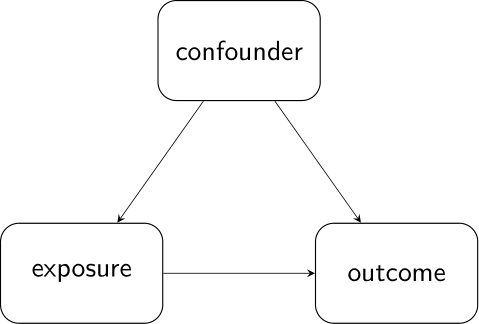
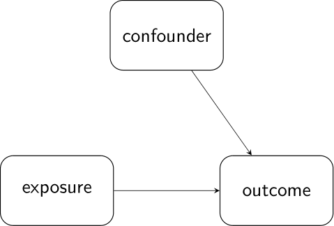
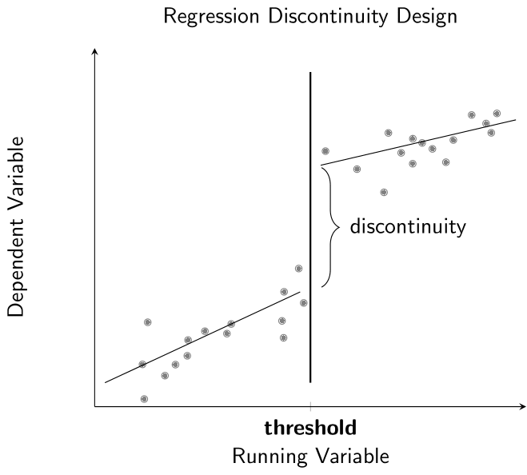
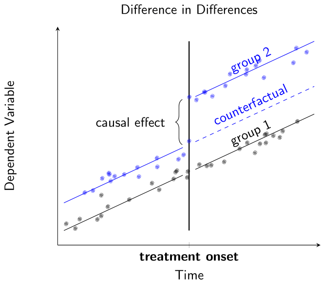
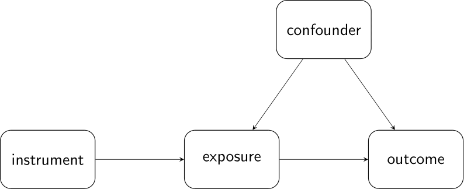

# Approaching Causal Questions in Practice



Causal calculus (or do-Calculus), as introduced by Judea Pearl [[Pearl2000](https://doi.org/10.1017/CBO9780511803161)], provides a very strong mathematical framework for causal inference problems. Some of its key aspects, such as the backdoor criterion, we introduced in previous posts. Hence, this report assumes, that the reader has a basic understanding of structural causal models, confounders, and counterfactuals. While do-Calculus can indeed deepen a person's understanding of the nature of causal relations, by itself, it gives only little guidance on answer causal questions in practice. Historically, some tools for causal analysis tools are even older than Pearl's theory [[Thistlethwaite1960](https://psycnet.apa.org/doi/10.1037/h0044319)]. Recently, [[Marinescu et al.](https://doi.org/10.1038/s41562-018-0466-5)] review the use of common causal analysis tool from economics in neuroscience and concluded that they are extremely underrepresented. In this post, we want to present some of these tools. Further, we want to sketch how theoretical results retroactively validate them as causality-tests.

## Randomized Experiments



Randomized experiments are yet the standard in testing causal relations. The principle idea is to minimize the effect of unknown confounders by randomizing the treatment exposure to the participating subjects. In particular, the experimenter gathers a group of subjects that are to participate in the experiment. This group is then divided into a control group and one or more treatment groups by chance. Assigning participants to treatment by chance prevents a selection bias and ideally leads to equal distribution in all groups. Generally, a equal group distributions are not a necessary assumption for causal analysis, but the mismatch may not exist in confounding variables or their dependents.

By controlling (in form of randomizing) the exposure to the treatment, one severs all incoming connections to the treatment variable in the structural causal graph [[Pourhoseingholi2012](https://www.ncbi.nlm.nih.gov/pmc/articles/PMC4017459/)]. We can, thus, interpret it as an adjustment for all confounding effects or for all variables that fulfill the backdoor criterion. As a result, a statistical analysis of data from randomized experiments equals its causal analysis [[Marinescu2018](https://doi.org/10.1038/s41562-018-0466-5)]. Pursuing the answer to a causal question, becomes a matter of experiment design, rather than employing special causal tests. Due to its straight forward application and interpretation of results, randomized experiments spread into many scientific areas. 

Sometimes, we cannot realize randomized experiments because the potentially causal variables are not directly accessible, controlling those is expensive, or expectations based on prior knowledge renders them unethical [[Marinescu2018](https://doi.org/10.1038/s41562-018-0466-5)]. In experimental neuroscience for example a randomized ansatz might require to precisely control the activity of a neural population, which, up to date, is technically not possible. We as experimenters are left to observe the system, and account for possible confounding factors in our analysis. In the following, we are presenting three "quasi-experimental" techniques originating from econometrics. 


## Quasi-Experimental Techniques

Quasi-Experimental techniques make assumptions, under which the data, or a subset of the data, can be treated as the outcome of a randomized experiment. Usually, they pave the way for a particular type of analysis.

### Regression Discontinuity Design (RDD)

RDD is applicable when a threshold in the independent variable determines the administration of the treatment. In case the treatment has a causal effect on the dependent variable, the dependent variable shows a discontinuity at the threshold. RDD can analytically show and estimate this discontinuity. 

The method requires that the outcome of the independent variable cannot be controlled precisely, wherefore datapoints, that lie in close vicinity to the threshold, end up on either of its sides by chance. Here, "above" and "below" constitutes a random assignment of a subset of the data into two groups. This allows us to identify a setup that parallels a randomized experiment, hence the name "quasi-experimental". 



The classical examples originates from the original RDD publication by [[Thistlethwaite1960](https://psycnet.apa.org/doi/10.1037/h0044319)], who tried to determine the causal effect of graduating with merits on future career. Students receive merits, when they score better than a specified threshold. The study found clear differences in distribution of students receiving and not receiving merits, e.g. in socioeconomic status. These differing variables constitute potential confounders. When approaching the threshold, however, these differences become negligible, and scoring above or below the crucial threshold becomes a matter of chance (e.g. day-dependent performance). We perform RDD on this subset of data around the threshold, for which group assignment is random. 

Typically, we shift the potential discontinuity by the threshold value, i.e. we shift it into zero, and fit a regression model to the subset that includes a dummy variable to encode the treatment. The regression formula, hence, has following general form. 
$$
Y_{i} \sim (\alpha_{0} + \beta_0 D_{i}) + (\alpha_{1} + \beta_1 D_{i})\tilde{X_i} + \sum_{k=2}^{K} (\alpha_{k} + \beta_k D_{i}) (\tilde{X_i})^{k},\:\:\tiny{\begin{aligned}Y&:\text{dependent variable}\\\tilde{X_i} = X_{i} - c&:\text{shifted independent variable}\\c&:\text{treshold value}\\D_{i}\in\{0,1\}&:\text{dummy variable indicating treatment}\end{aligned}}\\
$$
The model allows for causal effect of the treatment on all regression coefficients. Though, the coefficient $beta_0$ is of particular interest, as it quantifies the offset of the treated from the untreated subjects. If we have a true causal effect of the treatment, we can fit this coefficient with significance. 

Prior to analysis, we have to test or argue that the method's assumptions are met. Data must fall above or below threshold based on chance. In absence of the treatment, there must only be one underlying continuous and polynomial distribution. Further, the threshold must not coincide with a threshold in the confounding variable. 

For a detailed derivation, and a recipe for manual RDD we refer to [Thistlethwaite1960](https://psycnet.apa.org/doi/10.1037/h0044319), [Keio2016](http://web.mit.edu/teppei/www/teaching/Keio2016/05rd.pdf), and [Trochim2006](http://socialresearchmethods.net/kb/statrd.htm). [Magnusson](https://github.com/evan-magnusson/rdd) an out-of-the-box solution that works in python that works for basic RDD problems. The interface should feel familiar to everybody performing statistical analysis in Python, as it beautifully extends the ```statsmodels``` package. He also provides a tutorial, which facilitates first usage.

### Difference in Differences (DID)

DID assumes two groups are equally affected by unobserved and potentially confounding extraneous variables. Consequentially, the two groups evolve equally over time in the dependent variable of interest.  From a specific point in time, we expose only on of the two groups to a treatment. The untreated group serves as the control group. We then investigate whether time evolution of the treated group changes compared to control group with treatment onset [[Marinescu2018](https://doi.org/10.1038/s41562-018-0466-5)], i.e. we try to prove a difference in differences that is caused by the exposure to a treatment.



In the light of causal calculus, we can say, that DID, in a sense, exploits the concept of counterfactuals. The usual setup does not allow to observe the outcome for both, treatment and no treatment simultaneously. This is because we simply cannot go back in time, which we need to guarantee the exact same initial state. When we use DID, we also do not assume that our two groups are in the same initial state, but we assume that their time evolution is linked to the relevant confounding variables through the same causal mechanism. As a result, the expected trend of the treatment group provides us with a reasonable estimate to the answer of "How would the trend have looked like, if we had not applied the treatment?". We call the difference in the difference of the dependent variable our causal effect of the treatment. 

Performing DID analysis requires only knowledge about regression analysis. An example is given in the original paper by [Gruber1994](http://www.jstor.org/stable/2118071). A simple linear model looks as follows [Wikipedia: DID](https://en.wikipedia.org/wiki/Difference_in_differences#Implementation):
$$
Y_{i} \sim \beta_{0} + \beta_{1} T_{i} + \beta_{2} S_{i} + \beta_{3} S_{i} T_{i},
\:\tiny{\begin{aligned}
Y&:\text{dependent variable}\\
T\in\{0,1\}&:\text{dummy variable for period (before/after treatment)}\\
S\in\{0,1\}&:\text{dummy variable for group membership (control/treated group)}\end{aligned}}
$$


The coefficient $\hat{beta}_{3}$ is particularly interesting because rigorous derivation shows that it estimates the difference in differences, which we identified as our treatment effect:


$$
\begin{aligned}
\hat{\beta}_{3} = &\big[\hat{E}(y|T=1, S=1)-\hat{E}(y|T=0, S=1)\big]\\&-\big[\hat{E}(y|T=1, S=0)-\hat{E}(y|T=0, S=0)]
\end{aligned}
$$
A valid application of DID requires that the use tests or argues for the parallel trend assumption of the two groups. Moreover, the demographics of the two groups must stay constant during the entire observation. Finally, the user has to reason that any other changes in extraneous variables affect both groups equally.

### Instrumental Variables (IV)

The method of instrumental variables dates back to [Wright1928](https://books.google.de/books/about/The_Tariff_on_Animal_and_Vegetable_Oils.html?id=zJBBAAAAIAAJ&redir_esc=y). IV are variables, that are not confounded w.r.t. the observed variable, are dependent of the exposure, and causally affect the dependent variable only through the exposure [[statisticshowto](https://www.statisticshowto.datasciencecentral.com/instrumental-variable/)]. Doing that, we, again, adjust for the confounders. The method even allows us to assess and quantify the causal effect of the treatment despite confounding factors [[Pearl2000](https://doi.org/10.1017/CBO9780511803161), [Marinescu2018](https://doi.org/10.1038/s41562-018-0466-5)]



In the linear case, the confounder can be considered noise in the predictive model for the exposure (1), because instrument and confounder are independent. As a result, we can estimate the regression coefficients $\hat{\beta}$. We then use our knowledge of the value $\hat{\beta}Z_{i}$ to "simulate experiments", in which we control the treatment variable trough our instrument $Z$ [[Peters2017](https://mitpress.mit.edu/books/elements-causal-inference)]. The second stage model (2) regresses the outcome on the confounder and the exposure, and estimates us the regression coefficient $\hat{\alpha}$. $\hat{\alpha}$ corresponds to the estimated causal effect. For good results, it is important to have an instrument, that is strongly correlated to the exposure, in order to ensure a tight control, i.e. proper independence of the confounder.


$$
\begin{aligned}
&(1) &X_{i} &= \beta Z_{i} + \gamma C_{i} + \epsilon_{i}\\
&(2) &Y_{i} &\sim \alpha X_{i} + \delta C_{i} = \alpha(\beta Z_{i}) + (\alpha\gamma + \delta)C_{i}
\end{aligned},\:
\begin{aligned}
\tiny{Z_{i}: \text{instrument}\\
X_{i}:\text{independent variable}\\
C_{i}:\text{confoundind variable}\\
Y_{i}:\text{dependent variable}}
\end{aligned}
$$


## A Word of Caution: Do not dive in headlessly

<!-- Construct validity [from Pearl2000](http://causality.cs.ucla.edu/blog/index.php/category/do-calculus/) -->

